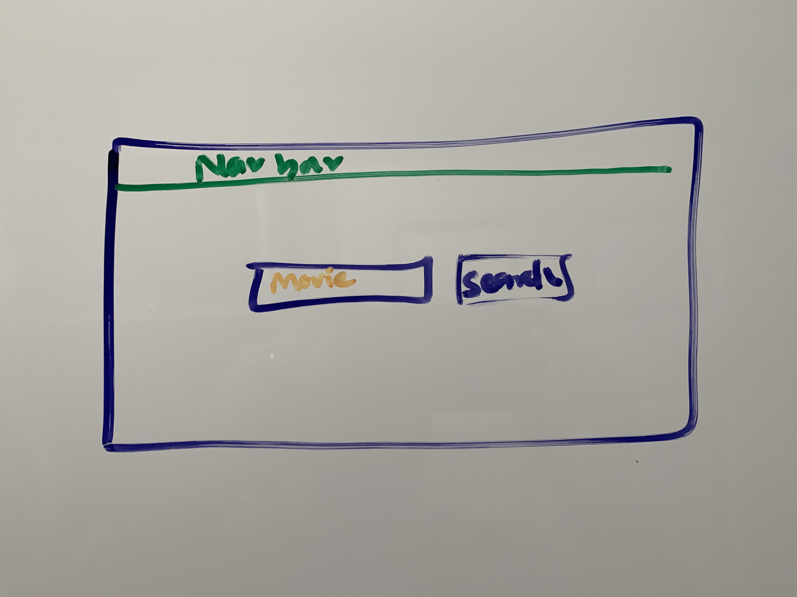
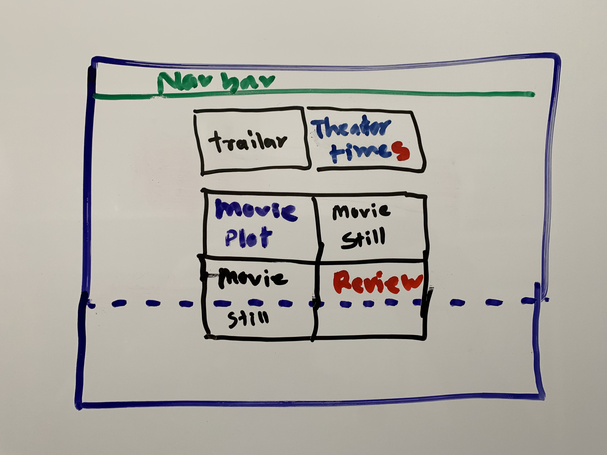
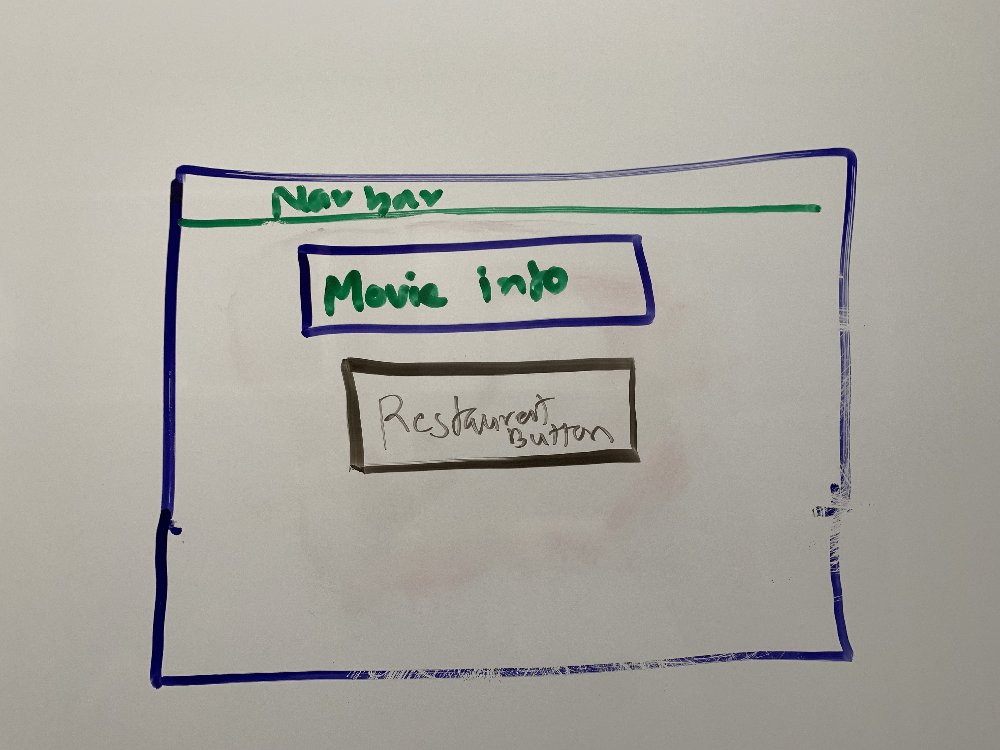
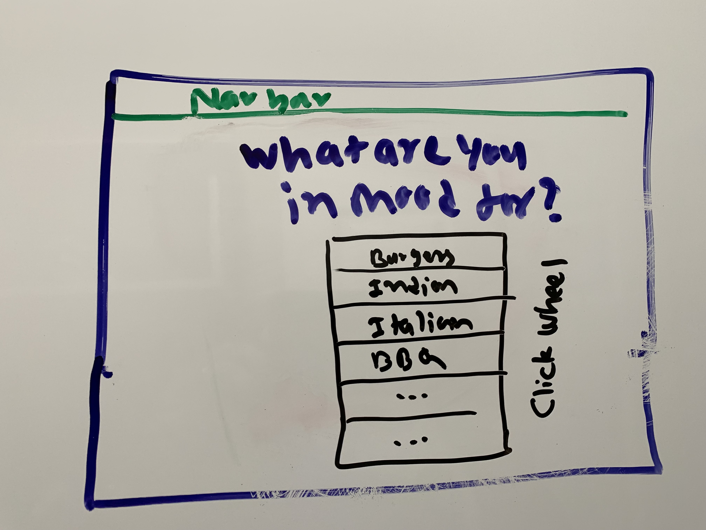

# Dinner and a movie

## Create Firebase database

## Movie search
- As a user, I would like to search a movie by what is playing near me.
## Restaurant serach
- As a user, I would like to search for a restaurant to eat at the best time before the movie.
## Taxi search
As a user, I would like to reserve a ride service to schedule a time for the restaurant.
## Buy a movie ticket

# Movie search story

## Search Screen

### Create wireframe
- The Main Screen

#### Create HTML

- Create JavaScript

	- Create functions

		- Build html
			- Build html (or jquery) for the page so we can call it anytime we like. and maybe able to call it multiple times.

		- Destroy html
			- Build a function to destroy our html so we can build a new one on the screen.

		- Fandango API call
			- Build a url, with the necessary information and create a function so we can call it anytime.

		- Save results in Firebase
			- whatever results we got, lets save it in firebase for later retrival

## Result screen

### Create Wireframe
- The movie result page

#### Create functions

- Build HTML

- Destroy html

- Pull data from firebase

- Populate in a table/card/modal

- Get user input

- save user input

- API call to Youtube

	- Get trailer

	- Crete Jquery html for trailer

	- add logic to play/pause trailer

## Create firebase table for movies

## User Selected screen

### wireframe
- The movie selected page

#### Create functions

- Build HTML

- Destroy HTML

- Populate data

- Build a button for restaurant

- Create event for button

# Restaurant search story

## Search Screen

### Create wireframe
- The restaurant page

#### Create JavaScript

- Create functions

	- Build html

	- Destroy html

	- Fandango API call

	- Save results in Firebase

## Result screen

### Create Wireframe

#### Create JavaScript
#### Create functions

- Build HTML

- Destroy html

- Pull data from firebase

- Populate in a table/card/modal

- Get user input

- save user input

- API call to Youtube

	- Get trailer

	- Crete Jquery html for trailer

	- add logic to play/pause trailer

## Create firebase restaurants

## User Selected screen

### wireframe

#### Create functions

- Build HTML

- Destroy HTML

- Populate data

- Build a button for restaurant

- Create event for button

